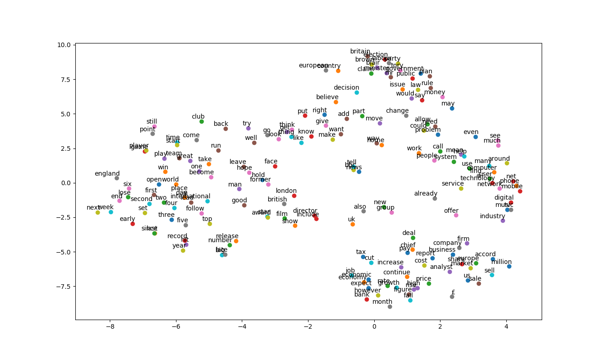

# News-Classification-LSTM

The objective of this project is to classify news category from articles. The input data consist of 2225 news articles from the BBC news website corresponding to stories in 5 topical areas (e.g., business, entertainment, politics, sport, tech). LSTM has been applied in the classification task to categorize articles.  

• TensorFlow 2.0 has been used to train the model. 
• Word embedding is used in feature generation. 
• TSNE is used to visualize the word vectors in 2d space. 
• L1 regularization is applied to prevent overfitting. 
• 95% accuracy has been achieved. 

# How to Run

Run the Classification_bbc_articles.py file and check wordEmbedding_bbc_news_data.py for visualization

# Visualization 

# Performance

# Saved Model

Use saved_model to quickly load the current model.

